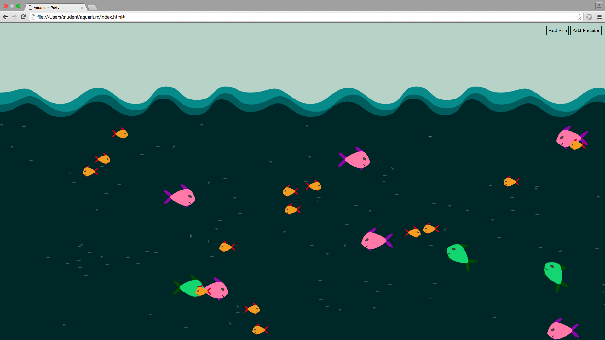

# Aquarium Party

**Aquarium Project** is a Junior project that was worked on at Hack Reactor. During this project we explored the pseudoclassical inheritance pattern.

[View Aquarium Party!](http://taptapdan.github.io/aquarium-party)

## Created By

* [Austin Baltes](https://github.com/austinba)
* [Daniel Fiore](https://github.com/taptapdan)

## What's Going On?

### Fish (Base Object)

* Swim left and right

### Predator (Delegates to Fish)

* Swim left and right
* Become hungry (and change color to indicate)
* Move towards Fish when hungry
* "Eat" Fish

### ScatterFish (Delegates to Fish)

* Swim left and right
* Scatter away from hungry Predator
